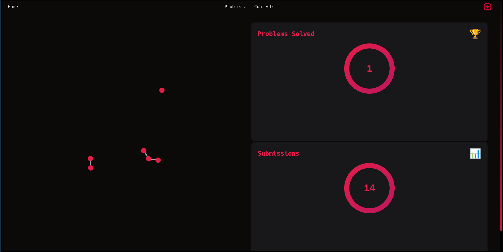

1# Code Nexus Linking Feature

Code Nexus provides a powerful linking feature that allows users to establish connections between two or more problems. This feature is particularly useful for generating an interactive graph view, enhancing visualization, and understanding the relationships between various problems within the platform.

## Key Features and Benefits

### 1. Problem Linking

- **Establishing Relationships**: Users can link problems to indicate dependencies, similarities, or any other relevant relationships.
- **Search Problems**: Users can search from problems by typing the name of the problem they want to link.
  
- **Graph Visualization**: The linked problems are visualized in an interactive graph format, which provides a clear and intuitive way to explore how different problems are connected.

### 2. Interactive Graph View

- **Visual Representation**: The graph view dynamically illustrates the linked problems and their connections.
  
- **Node Interaction**: Users can interact with nodes (problems) in the graph to view details, such as problem descriptions, tags, and related discussions.

### 3. Enhancing Understanding

- **Connection Insights**: By viewing the connections between problems, users gain insights into how different topics or issues are interrelated.
  
- **Navigational Aid**: Helps users navigate through a multitude of problems more effectively by showing direct and indirect links between them.

## How It Works

1. **Link Creation**: Users can create links between problems through a straightforward interface. This process typically involves selecting a problem and specifying the nature of the link (e.g., dependency, similarity).

2. **Graph Visualization**: Once linked, the platform automatically updates the graph view. Users can explore this view by zooming in/out, dragging nodes, and clicking on nodes for detailed information.

3. **Interaction and Exploration**: Users can interact with the graph by clicking on the home icon to explore related problems and gain a deeper understanding of their connections , when user hover over the text they can see the name of the problem and on clicking a vertex they will be redirected to the problem itself

## Example Use Case

## Conclusion

The linking feature in Code Nexus enhances the platform's utility by providing a visual and interactive way to explore the relationships between problems. It promotes better comprehension of problem sets, aids in strategic planning, and enriches the overall user experience.
